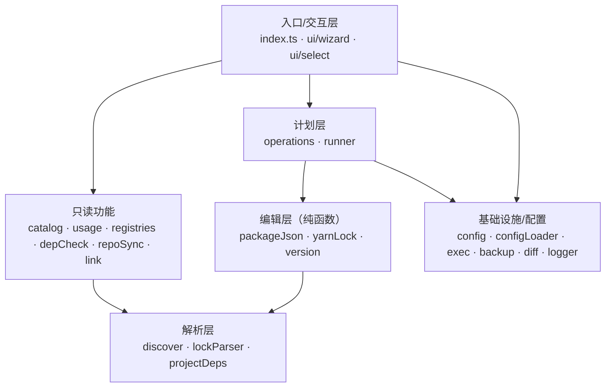

# Sejuani (`sjn`)

批量管理前端**工程（projects）**与**组件库（components）**的 `package.json` / `yarn.lock`，并提供仓同步与依赖治理的终端工具。

- 运行环境：Node 16+
- 交互式向导为主，同时提供完整 CLI 子命令
- 所有写操作统一走「预览 → 确认 → `.bak` 备份 → 写入」，支持 `--dry-run` / `-y`

## 安装 / 构建

```bash
npm install
npm run build
node dist/index.js -h      # 或链接为 sjn 后：sjn -h
```

## 常用命令

```bash
sjn                                  # 交互式向导（推荐）
sjn catalog                          # 组件库清单：名称 + 版本
sjn usage                            # 全工程组件用量统计
sjn who-uses @f6p/xxx                # 某组件被哪些工程使用
sjn project-deps my-app              # 某工程用了哪些组件
sjn upgrade --dry-run --diff         # 预览升级工程内组件到 catalog 精确版本
sjn registries --by-component        # 枚举 yarn.lock 中的仓库
sjn check-deps --only-missing        # 校验依赖 URL 可用性
sjn sync --dry-run                   # 仓同步：pack → publish → 清理
sjn guide                            # 完整中文手册
```

## 命令分类

| 类别 | 命令 |
| --- | --- |
| 交互式 | `start`（默认，即 `sjn`） |
| 批量编辑（写） | `replace-url` · `set-version` · `set-name` · `upgrade` · `link` · `sync` |
| 依赖治理（只读） | `registries` · `check-deps` |
| 查询统计（只读） | `catalog` · `who-uses` · `project-deps` · `usage` |
| 帮助 | `guide` · `-h` |

扫描目标优先级：`--dir` > `--projects` > `--components` > 配置 / 内置默认。配置文件为就近查找的 `sejuani.config.json`（可用 `-c/--config` 指定）。

## 架构概览



## 详细文档

完整功能说明、配置标准、命令参考、模块设计与数据流图见 **[docs/功能文档.md](docs/功能文档.md)**。
