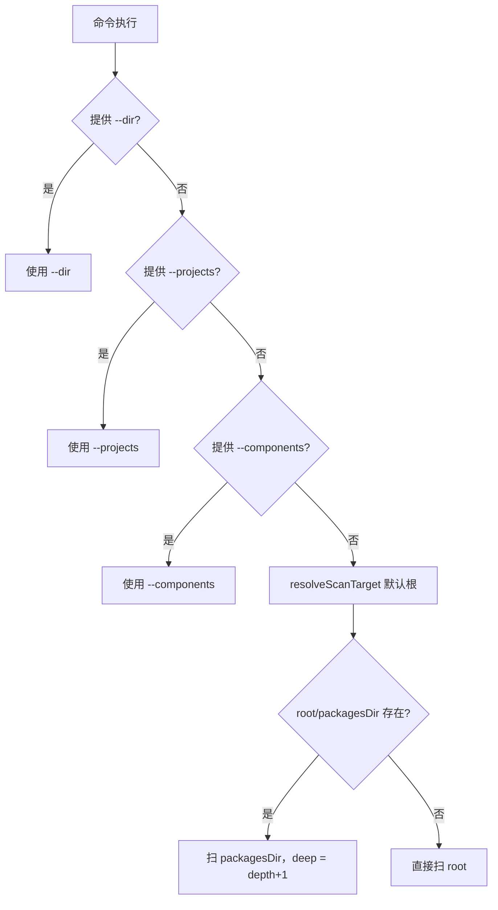
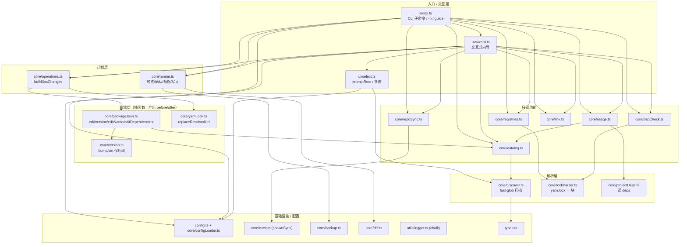
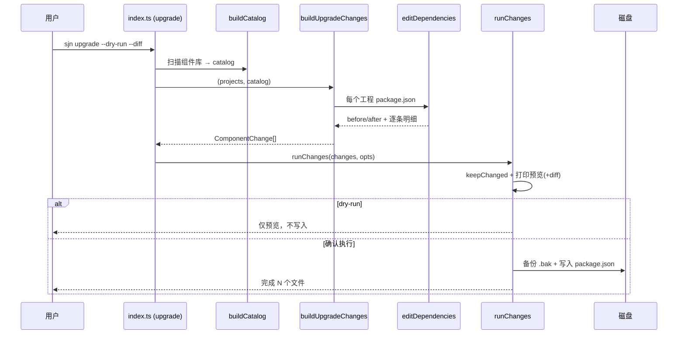
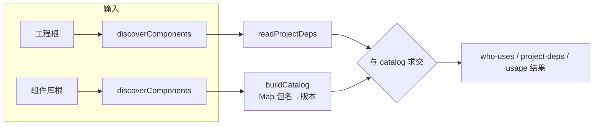
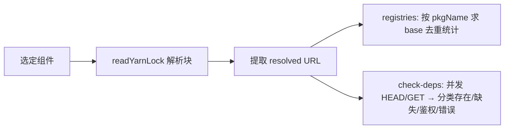

# Sejuani 功能文档

> 批量管理前端**工程（projects）**与**组件库（components）**的 `package.json` / `yarn.lock`，并提供仓同步与依赖治理的终端工具。命令别名 `sjn`。

- 运行环境：Node 16+（依赖 `chalk@4` / `inquirer@8` / `commander@11` / `fast-glob@3`，均为 CommonJS）
- 语言：TypeScript → 编译为 CommonJS（`tsc`）
- 无运行时新增网络依赖：依赖校验使用 Node 内置 `http`/`https`

---

## 目录

1. [快速开始](#快速开始)
2. [核心概念](#核心概念)
3. [配置标准 sejuani.config.json](#配置标准-sejuaniconfigjson)
4. [扫描目标解析规则](#扫描目标解析规则)
5. [命令参考](#命令参考)
6. [安全模式（写操作）](#安全模式写操作)
7. [架构与模块设计](#架构与模块设计)
8. [关键数据流](#关键数据流)
9. [模块清单](#模块清单)
10. [术语表](#术语表)

---

## 快速开始

```bash
# 安装依赖并编译
npm install
npm run build

# 交互式向导（推荐，菜单化驱动全部能力）
node dist/index.js            # 或链接为 sjn 后：sjn

# 查看帮助 / 完整手册
sjn -h
sjn guide
```

典型只读查询（不改动任何文件）：

```bash
sjn catalog                          # 组件库清单：名称 + 版本
sjn usage                            # 全工程组件用量统计
sjn who-uses @f6p/account-book-shop  # 某组件被哪些工程使用
sjn project-deps my-app              # 某工程用了哪些组件
```

典型写操作（默认先干跑预览）：

```bash
sjn upgrade --dry-run --diff   # 预览：把工程内组件依赖升级到 catalog 精确版本
sjn upgrade -y                 # 确认执行（自动 .bak 备份）
```

---

## 核心概念

| 概念 | 说明 |
| --- | --- |
| **工程 projects** | 消费组件的应用仓库集合，通过 `dependencies` / `devDependencies` 引用组件 |
| **组件库 components** | 我们自己维护的组件仓库集合，每个组件是一个含 `package.json` 的包 |
| **catalog** | 扫描组件库得到的 `Map<包名, {version, dir}>`，是**判定“我们自己的组件” vs 第三方依赖的唯一来源** |
| **Component（内部模型）** | 一个含 `package.json` 的目录（工程或组件统一用此模型表示） |
| **写操作安全模式** | 预览 → 确认 → `.bak` 备份 → 写入，所有编辑类命令统一走此流程 |

> 判定原则：只有出现在组件库 catalog 中的依赖才被视为“我们的组件”，参与 `who-uses` / `project-deps` / `usage` / `upgrade`；不在 catalog 中的依赖视为第三方，不处理。

---

## 配置标准 sejuani.config.json

替代 `rh.toml`，作为定位工程/组件的自有标准。加载优先级：

1. `--config <file>` 显式指定；
2. 否则从当前工作目录**向上逐级查找** `sejuani.config.json`；
3. 都没有时，回退到 [`src/config.ts`](../src/config.ts) 内置默认。

Schema：

```jsonc
{
  "registries": {
    "pack": "https://npm.f6yc.com",                                   // npm pack 拉取源
    "publish": "http://nexus-ditc.mychery.com/repository/chery-sumeida-npm/" // npm publish 目标
  },
  "roots": {
    "projects":   { "root": "<工程根>",   "packagesDir": "workspace", "depth": 1 },
    "components": { "root": "<组件库根>", "packagesDir": "workspace", "depth": 1 }
  }
}
```

- 配置以 **deep-merge** 覆盖内置默认：只写部分字段时，其余字段沿用默认值。
- `packagesDir`：包目录相对根的子目录（如 rhea 的 `workspace`）。
- `depth`：`packagesDir` 下的**子目录层数**（`depth: 1` 表示 `workspace/*/package.json`）。

---

## 扫描目标解析规则

### 由配置解析（`resolveScanTarget`）

对某个 `roots.projects` / `roots.components`：

- 若 `<root>/<packagesDir>` **存在** → 扫描该子目录，深度 = `depth`；
- 否则 → 直接扫描 `<root>`（不限深度）。

> 注意：内部把 `depth` 映射为 fast-glob 的 `deep = depth + 1`，因为 `package.json` 文件本身也占一层（`depth:1` → glob deep `2` → 命中 `workspace/*/package.json`）。

### 由命令行覆盖（`--dir` / `--projects` / `--components`）

扫描目标优先级（三者都会生效）：

```
--dir  >  --projects  >  --components  >  配置/内置默认（命令的默认 kind）
```

- 需要**两个根**的命令（`who-uses` / `project-deps` / `usage` / `upgrade`）：
  - 工程根来自 `--projects` 或配置 `roots.projects`；
  - 组件库根来自 `--components` 或配置 `roots.components`。



---

## 命令参考

命令分五类：**交互式 / 批量编辑 / 依赖治理 / 查询统计 / 帮助**。

### 通用选项

| 选项 | 说明 |
| --- | --- |
| `-c, --config <file>` | 指定 `sejuani.config.json`（默认就近向上查找） |
| `-d, --dir <dir>` | 直接指定扫描目录（优先级最高） |
| `--projects <dir>` | 工程根目录（覆盖配置） |
| `--components <dir>` | 组件库根目录（覆盖配置） |

### 写操作安全选项（`replace-url` / `set-version` / `set-name` / `upgrade`）

| 选项 | 说明 |
| --- | --- |
| `--dry-run` | 仅预览不写入 |
| `-y, --yes` | 跳过交互确认（CI 场景） |
| `--no-backup` | 不生成 `.bak` 备份 |
| `--diff` | 展示逐行 diff |

### 交互式

| 命令 | 用途 |
| --- | --- |
| `start`（默认） | 启动交互式向导，菜单化驱动全部能力。等价于直接运行 `sjn` |

### 批量编辑（写操作）

| 命令 | 用途 | 关键选项 / 示例 |
| --- | --- | --- |
| `replace-url` | 批量替换 `yarn.lock` 中 `resolved` 的 URL 片段 | `-f/--from`、`-t/--to`。例：`sjn replace-url -f https://npm.f6yc.com -t http://nexus-.../npm --dry-run` |
| `set-version` | 批量改 `package.json` version（保留 `-后缀`） | `-b/--bump patch\|minor\|major` 或 `-t/--to <ver>`、`--keep-suffix` |
| `set-name` | 批量改 `package.json` name | `--find/--replace` 子串替换 或 `-t/--to` 整体设值 |
| `upgrade` | 按组件库 catalog **精确版本**升级工程内组件依赖 | 仅改 `package.json`，不动 `yarn.lock`。例：`sjn upgrade --dry-run --diff` |
| `link` | 把选定组件以**软链**聚合到一个虚拟空间目录 | `-i/--into <dir>`、`--force` |
| `sync` | 仓同步：对每个组件 `npm pack` → `npm publish` → 清理 tgz | `--pack-registry`、`--publish-registry`、`--work-dir`、`--dry-run` |

### 依赖治理（只读）

| 命令 | 用途 | 关键选项 |
| --- | --- | --- |
| `registries` | 枚举 `yarn.lock` 中出现的所有仓库（registry base）及命中统计 | `--by-component` 展开每个仓库涉及的组件 |
| `check-deps` | 批量校验 `resolved` 依赖 URL 是否可访问（HEAD，405/501 回退 GET） | `--concurrency`、`--timeout`、`--only-missing`。分类：存在 / 缺失404 / 需鉴权(401/403) / 错误 |

### 查询统计（只读）

| 命令 | 用途 | 关键选项 |
| --- | --- | --- |
| `catalog` | 列出组件库下每个组件的名称 + 版本（+ 目录） | `--json` |
| `who-uses <component>` | 某组件被哪些工程使用（含声明 range / section） | — |
| `project-deps <project>` | 某工程用了哪些组件（含 `可升级` 标记） | — |
| `usage` | 全工程组件用量统计 + 未被任何工程使用的组件清单 | `--json` |

### 帮助

| 命令 | 用途 |
| --- | --- |
| `guide` | 打印完整中文使用手册（配置、预设、安全模式、命令、常见组合） |
| `-h, --help` | 命令总览 + 分类 + 通用选项 + 示例 |

---

## 安全模式（写操作）

所有编辑类命令统一经过 [`runChanges`](../src/core/runner.ts)：

1. **构建变更计划**：各命令产出 `ComponentChange[]`（每个文件带 `before` / `after` / `hits` / `summary`）。
2. **过滤无变化项**：`keepChanged` 仅保留 `after !== before` 的文件。
3. **预览**：打印每个组件/文件的变更摘要；`--diff` 时展示逐行 diff。
4. **干跑短路**：`--dry-run` 到此为止，不写任何文件。
5. **确认**：非 `-y` 时交互确认。
6. **备份 + 写入**：`--backup`（默认开）先写 `<file>.bak`（已存在则加时间戳），再写入新内容。

> `sync` 与 `link` 不产出文件 diff，但同样遵循「预览 → 确认（`-y` 跳过）→ 执行」，且 `sync --dry-run` 只打印将执行的命令。

---

## 架构与模块设计

分层：**入口/交互层 → 计划层 → 编辑层 → 解析层 → 基础设施/配置**。上层依赖下层，下层不反向依赖。



设计要点：

- **编辑层是纯函数**：只读入文件、计算 `before/after`，不落盘；落盘统一由 `runner` 负责，便于预览与测试。
- **catalog 是单一事实源**：`usage` / `upgrade` 都依赖它判定组件归属，避免各处硬编码 `@f6p/*` 之类前缀。
- **解析层无副作用**：`discover` / `lockParser` / `projectDeps` 只读，可被任意功能复用。

---

## 关键数据流

### 编辑类命令（以 upgrade 为例）



### 只读查询（catalog / usage / who-uses / project-deps）



### 依赖治理（registries / check-deps）



---

## 模块清单

| 文件 | 职责 |
| --- | --- |
| [`src/index.ts`](../src/index.ts) | CLI 入口：注册全部子命令、`-h` 帮助、`guide` 手册、扫描目标解析 |
| [`src/config.ts`](../src/config.ts) | 内置默认配置（registry + 两个 rhea 根）、`CONFIG_FILENAME` |
| [`src/core/configLoader.ts`](../src/core/configLoader.ts) | 加载/合并配置、`resolveScanTarget`（约定定位 packagesDir） |
| [`src/core/discover.ts`](../src/core/discover.ts) | fast-glob 扫描含 `package.json` 的目录，支持 `maxDepth` / `requireYarnLock` |
| [`src/core/lockParser.ts`](../src/core/lockParser.ts) | 轻量解析 yarn.lock v1 为块（keys/name/version/resolved） |
| [`src/core/projectDeps.ts`](../src/core/projectDeps.ts) | 读取工程 `dependencies` + `devDependencies` |
| [`src/core/catalog.ts`](../src/core/catalog.ts) | 构建组件 catalog、`printCatalog`（Feature 4） |
| [`src/core/version.ts`](../src/core/version.ts) | 版本 bump/set，保留 `-chery` 等后缀 |
| [`src/core/packageJson.ts`](../src/core/packageJson.ts) | 编辑 package.json：version / name / dependencies（精确版本升级） |
| [`src/core/yarnLock.ts`](../src/core/yarnLock.ts) | 仅在 `resolved "..."` 行内替换 URL 片段 |
| [`src/core/operations.ts`](../src/core/operations.ts) | 把编辑层组装成 `ComponentChange[]` 计划 |
| [`src/core/runner.ts`](../src/core/runner.ts) | 统一执行：预览 → 确认 → 备份 → 写入 |
| [`src/core/backup.ts`](../src/core/backup.ts) | `.bak` 备份 + 安全写入 |
| [`src/core/diff.ts`](../src/core/diff.ts) | 轻量行级 diff 渲染（适用于等行数原地替换） |
| [`src/core/usage.ts`](../src/core/usage.ts) | who-uses / project-deps / usage（Feature 1/2/3） |
| [`src/core/registries.ts`](../src/core/registries.ts) | 枚举 yarn.lock 仓库（Feature B） |
| [`src/core/depCheck.ts`](../src/core/depCheck.ts) | 并发校验依赖 URL 可用性（Feature C，内置 http/https） |
| [`src/core/repoSync.ts`](../src/core/repoSync.ts) | 仓同步 pack→publish→清理（Feature A） |
| [`src/core/exec.ts`](../src/core/exec.ts) | `spawnSync` 封装（数组参数，无 shell 注入） |
| [`src/core/link.ts`](../src/core/link.ts) | 虚拟空间软链聚合 |
| [`src/ui/select.ts`](../src/ui/select.ts) | `promptRoot`（工程/组件库/手动）+ 组件多选 |
| [`src/ui/wizard.ts`](../src/ui/wizard.ts) | 交互式主向导，接入全部功能 |
| [`src/utils/logger.ts`](../src/utils/logger.ts) | 带颜色的分级日志（chalk） |
| [`src/types.ts`](../src/types.ts) | `Component` / `FileChange` / `ComponentChange` 模型 |

---

## 术语表

| 术语 | 含义 |
| --- | --- |
| registry base | `resolved` URL 去掉 `/<pkg>/-/<file>.tgz` 后的仓库前缀，如 `https://npm.f6yc.com` |
| 精确版本 | 忽略 `^`/`~` 区间前缀，直接写 catalog 的原始版本串（如 `1.0.2` / `1.0.2-chery`） |
| 后缀（suffix） | 版本号 `major.minor.patch` 之后的原样部分（`-chery`、`+build.1` 等） |
| 虚拟空间 | 用软链把分散的真实组件聚合到一个目录，便于统一查看/打开，不移动真实文件 |

---

## 已知约束与假设

- `sync` 的 `npm publish` 依赖本机 `.npmrc` 已配置目标 nexus 鉴权；工具只编排命令并汇总失败。
- `check-deps` 直接校验 lock 原始 URL；需鉴权仓库的匿名请求可能返回 401/403，会单独归类为“需鉴权”而非“缺失”。
- `upgrade` 只改写 `package.json`，**不改 `yarn.lock`**；升级后需在各工程重新 `yarn install`。
- `diff` 为按行号位置对比，适用于本工具的等行数原地替换；如未来支持增删行需改用 LCS diff。
